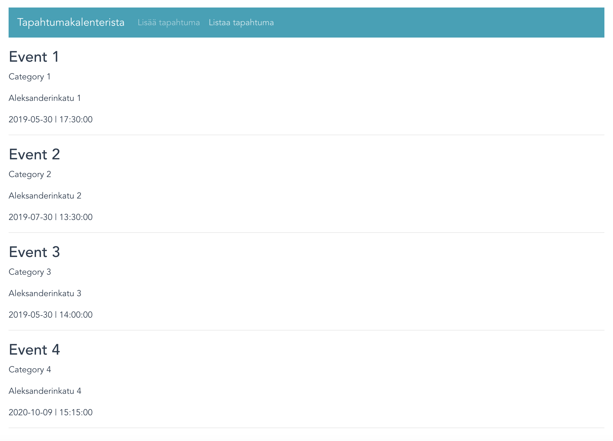
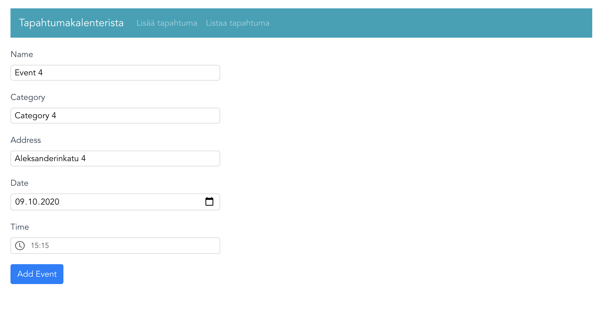
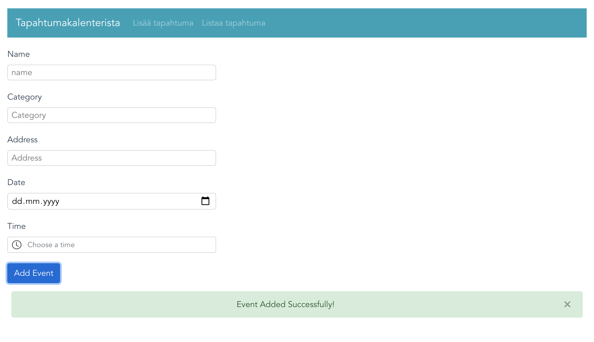
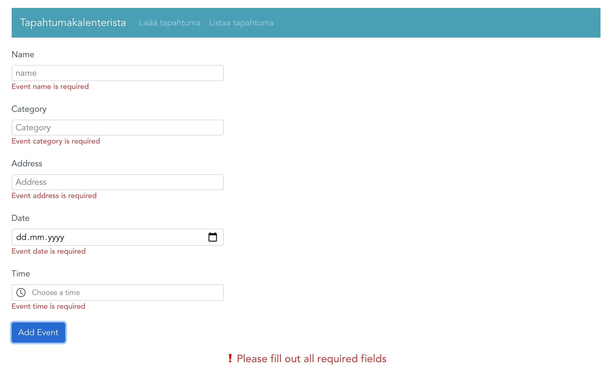
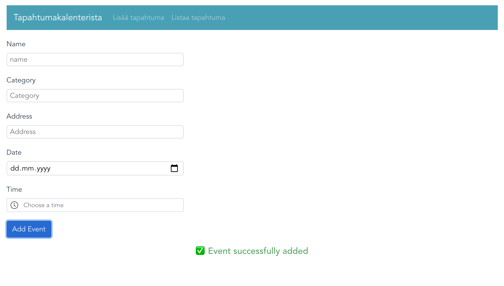

# vueroutermenu
A simple Menu-implementation with Vue-Router: https://appdividend.com/2018/12/28/vue-router-tutorial-with-example-how-to-use-routing-in-vuejs/

## List Events

## Add Event

## Event Submitted

## Form validation error

## form validation success


## Project setup
```
npm install
Also npm install vue-router and npm install bootstrap-vue is needed.
```

### Compiles and hot-reloads for development
```
npm run serve
```

### Compiles and minifies for production
```
npm run build
```

### Lints and fixes files
```
npm run lint
```

### Customize configuration
See [Configuration Reference](https://cli.vuejs.org/config/).


